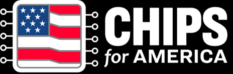
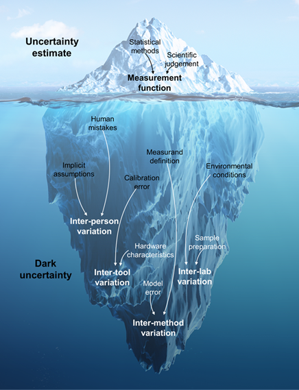
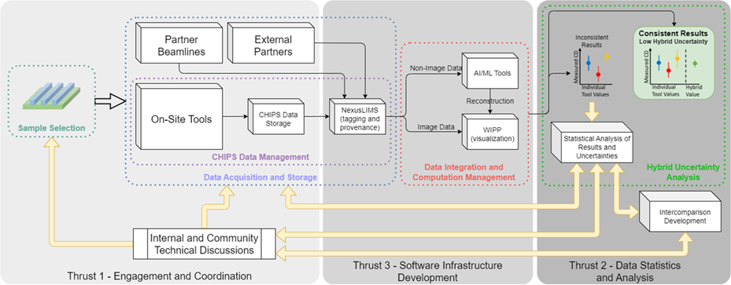
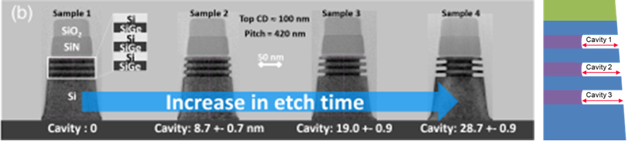

## Empowering Combined and Hybrid Metrology

<figure>

</figure>

## Abstract

This project will develop technologies and methodologies that empower
CHIPS Metrology teams and industry to perform hybrid metrology: the
direct integration of experimental results from different modalities of
measurement on a common sample or structure. Results of methods of
different probe type, dimensionality, and chemical specificity will be
statistically combined to measure and reduce joint uncertainty.
Computational and statistical methods will be applied to increase the
accuracy of critical dimension measurements and shrink the uncertainty
envelope. Software tools created for this effort, including NexusLIMS
(data and metadata extractor and repository) and WIPP (traceable and
scalable computations including data spatial registration and
visualization) will be made available for use by industry at large and
other CHIPS efforts at NIST.

## Project Team

- Michael Katz, Office of Data and Informatics
- Peter Bajcsy, Software and Systems Division
- Ronald Dixson, Microsystems and Nanotechnology Division
- Mark-Alexander Henn, Applied and Computational Mathematics Division
- Adam Pintar, Statistical Engineering Division
- Samuel Stavis, Microsystems and Nanotechnology Division
- Suzanne Thornton, Statistical Engineering Division
- John Villarrubia, Microsystems and Nanotechnology Division

  

Grand Challenge 2: Advanced Metrology for Future Microelectronics
Manufacturing Portfolio

## Challenge

- Feature sizes in integrated circuits are becoming ever smaller while
  device structures are simultaneously becoming more complex and more
  difficult to measure with moves to three-dimensional architectures and
  novel materials.
- Measurands are at levels where the uncertainties in measurement are
  becoming a limiting factor preventing the optimization of the
  parameter in question for manufacturability.
- Dark uncertainty – the unknown and uncharacterized uncertainties in
  measurement – pervades efforts to achieve the most accurate and
  precise measurement of a given measurand by hybrid metrology.

	

	<figure>
	
   
	<figcaption>Fig.1: Sources of dark uncertainty.</figcaption>
	</figure>

	

## Why does it matter?

- Hybrid metrology, which combines measurements of the same measurand
  from multiple modalities, can be used to decrease measurement
  uncertainty and increase accuracy.
- Though hybrid metrology may require more and, perhaps, slower
  measurements, the gains from higher yields, more consistently
  fabricated structures, and increases in the accuracy of in-line
  metrology and inspection can be a profitable trade-off.

## Technical Plan

- Engagement and Coordination
  - Utilizing metrology resources from the CHIPS R&D program, have
    various CHIPS groups conduct measurements on the same samples using
    their own industrially relevant modalities.
  - Combine multi-modal measurements (e.g. EUV scatterometry, CDSAXS,
    SEM) into a high-accuracy value for the critical dimension using
    hierarchical statistical models.
- Data Statistics and Analysis
  - Using statistical analysis and measurements, investigate sources of
    uncertainties in measurements and quantify both known and dark
    uncertainties.
  - Inter-comparison sample and experiment design will be iteratively
    used to develop methods for optimizing hybrid metrology efforts.
    Software Infrastructure Development
  - Current NIST resources NexusLIMS and WIPP will be expanded,
    interconnected, and augmented with ML/AI algorithms to facilitate
    hybrid metrology and analysis.
  - Computations will be traceable and software tools will be made
    interoperable and available to industry.

	

	<figure>
	
   
	<figcaption>Fig. 2: Overall project workflow.</figcaption>
	</figure>

	

## Outcomes

- Work with a number of industry partners to advance hybrid metrology
  and develop methodological standards and metrics.
- Develop NIST’s own capabilities to conduct hybrid metrology for its
  CHIPS R&D Metrology efforts and beyond.
- Create and release a suite of software tools to perform hybrid
  metrology and better quantify uncertainty.
- Make multi-modal data and methodology public via METIS (Metrology
  Exchange to Innovate in Semiconductors).
- Draft recommendations to create a standard reference material for
  hybrid metrology.

	

	<figure>
	
   
	<figcaption>Fig.3: Future logic architecture
	roadmap2.</figcaption>
	</figure>
	

## Success Metrics

- Decreased uncertainty in semiconductor device critical parameter
  measurements and will provide methods, tools, and materials to empower
  industry to do the same.

## Stakeholder Engagement Strategy

- Materials transfer agreements to supply industrially relevant samples
  whose measurements challenges best leverage hybrid metrology.
- Industry players participate on hybrid metrology methods and consensus
  measurement efforts via the Metrology Community.

## References

- 1\. J. Bogdanowicz et al. "Semiconductor metrology for the 3D era",
  Proc. SPIE 12496, Metrology, Inspection, and Process Control XXXVII,
  1249617 (30 April 2023)
- [2. International Roadmap for Devices and Systems
  (IRDS)](https://irds.ieee.org/images/files/pdf/2023/2023IRDS_MET.pdf)

## Disclaimer

\*Certain commercial equipment is identified here to describe the
experimental procedure adequately. Such identification does not imply
recommendation or endorsement by the National Institute of Standards and
Technology, nor does it mean that the equipment identified is the best
available.

